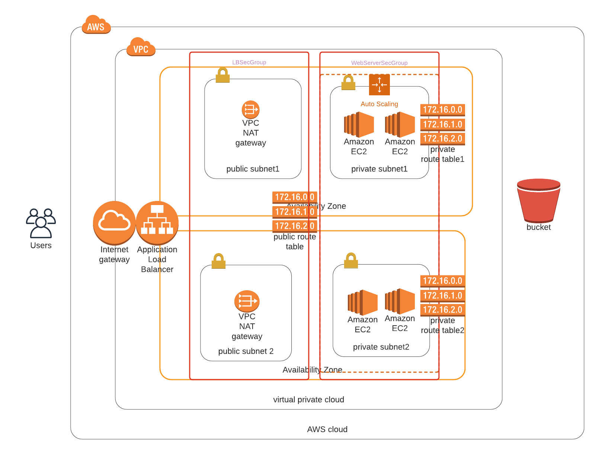

# cloud-formation-script
CloudFormation Script for AWS

#### Deploy an application (Apache Web Server) and pick up code (JavaScript and HTML) from S3 Storage and deploy it in the appropriate folder on the web server.

## Server specs

Launch Configuration for application servers, to deploy **four servers, two located in each of your private subnets**. 
The launch configuration is used by an auto-scaling group.

### Machine Specs

* two vCPUs 
* at least 4GB of RAM
* Ubuntu 1
* at least 10GB of disk spac

## Security Groups and Roles

In order to download the application archive from an S3 Bucket, you'll need to create an IAM Role that allows your instances to use the S3 Service.

Application communicates on the default HTTP Port: 80, so your servers will need this inbound port open since you will use it with the Load Balancer and the Load Balancer Health Check. As for outbound, the servers will need unrestricted internet access to be able to download and update its software.

The load balancer should allow all public traffic (0.0.0.0/0) on port 80 inbound, which is the default HTTP port. Outbound, it will only be using port 80 to reach the internal servers.

The application needs to be deployed into private subnets with a Load Balancer located in a public subnet.

One of the **output exports** of the CloudFormation script should be the **public URL of the LoadBalancer**.

### Infrastructure Diagram

